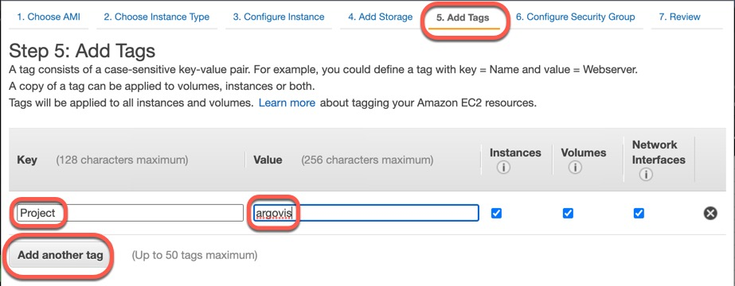

## Project Tagging Requirement for ucboitrccumulus

### Document Purpose

This document describes the requirements that are expected of end users when using the **CUmulus** AWS Account.
The **CUmulus** AWS Account is a 'sandbox' like, shared AWS Account, that different Projects can use to consume an allocation of AWS Credits for prototyping and research activities.
The **CUmulus** AWS Account is not intended for long term production workloads.
In order to properly track the usage of your allocation, please be sure to follow the steps in this document to ensure that you are properly tagging your resources.

### AWS Resource Tagging

AWS resource tagging is critical for tracking actual costs (ie. credits), as well as forecasted costs.
As a user of the **CUmulus** environment, you are responsible for tagging all resources that are created in your Project.
The tag must be applied when (if possible), or immediately after, the resource is created.
For more information about how tags work, it's worth reading the <a href="https://docs.aws.amazon.com/general/latest/gr/aws_tagging.html" target="_blank">AWS documentation describing Tags</a>.
If you are unfamiliar with the terms "tag key" and "tag value", please read and understand the <a href="https://docs.aws.amazon.com/general/latest/gr/aws_tagging.html" target="_blank">AWS documentation describing Tags</a>.

### Project Tag

We are using the concept of a "Project" Tag to track different projects that will be using the shared **CUmulus** AWS Account.

When tagging resources, <u>there is only one tag that we require you to provide</u>.
This is the "**Project**" tag.
You are free to add more tags, as there are several other benefits of tagging discussed in the <a href="https://docs.aws.amazon.com/general/latest/gr/aws_tagging.html" target="_blank">AWS documentation describing Tags</a>.

<!---
Info Table
-->
<table style="background-color: #dcdcdc; filter: alpha(opacity=40); opacity: 0.95;">
<tr>
<td>
<b>( ! ) - IMPORTANT</b>
</td>
</tr>
<tr>
<td>
The "tag <b>key</b>" is case sensitive.
This means that "<span style="color:green"><b>Project</b>"</span> is valid (must contain the capital 'P').
Using "<span style="color:red">project</span>" (all lower case) as the key will generate an error, and this is the expected behavior.
</td>
</tr>
</table>
<br>

The "tag **value**" will be the name of the Project that is given to you when your project was on-boarded by the **Research Computing Cloud Team** (ie. argovis, flywheel).
The value must match exactly, and is case-sensitive.
You may not use any other value other than the one given to your Project.
Values that do not match a project will cause errors.
This is expected behavior.

There is no way to currently require the user to create the necessary Project tag when creating resources.
This is a current limitation with AWS.
This is why users need to be in the good habit of always adding the Project tag to all resources.

### Tag Examples

<!---
Info Table
-->
<table style="background-color: #dcdcdc; filter: alpha(opacity=40); opacity: 0.95;">
<tr>
<td>
<b>( ! ) - IMPORTANT</b>
</td>
</tr>
<tr>
<td>
<span style="color:red">
The following examples show the Project Value = argovis.
<b>Use the name of your project instead</b> (ie. flywheel), and do not use the argovis value.
</span>
</td>
</tr>
</table>
<br>

For the following examples, the tag value (or name of the Project) is "**argovis**" (all lower-case).
Almost every resource that you create in the AWS Console will have a 'Tags' section as described in the following examples.

#### Tag S3 Bucket in AWS Console

When creating a S3 Bucket, be sure to look for the 'Tags' section.
Click the 'Add tag' button, then enter the Key = **Project** and the Value = **argovis**.


Note that the creation wizard for this example is a single form, which is common for many AWS services.
Look for the Tags section.

#### Tag EC2 Instance in AWS Console

On step 5 of the EC2 launch wizard, click the "Add tag" button, then enter Key = **Project** and the Value = **argovis**.



Note that the creation wizard for this example has more than one step, which is common for many AWS services.
Be sure to add your tag(s) when you get to the proper step.
This can be easy to miss, so look carefully!

#### Clustered Services

When creating clustered environments, especially when using autoscaling, be sure to set your template up to set the default tags so that when resources are spun up and down, the proper tag will get added for you automatically.
See AWS documentation for the specific service to see how to set the default tags (ie. EKS for Kubernetes).

#### Tags Block in a CloudFormation Template

When using AWS CloudFormation to create resources, you will need to specify the 'Tags' block.
See <a href="https://docs.aws.amazon.com/AWSCloudFormation/latest/UserGuide/aws-properties-resource-tags.html" target="_blank">AWS CloudFormation Resource Tag Documentation</a> for more details.
Each resource in the CloudFormation template will need to have the 'Tags' block added as specified in the AWS documentation for each resource block.
Syntax can be different for each service, so always consult AWS docs as a best practice.

**CloudFormation Tags Snippet:**
```json
...

"Tags" : [
    {
        "Key" : "Project",
        "Value" : "argovis"
    },
    {
        "Key" : "keyname2",
        "Value" : "value2"
    }
]

...
```

The above example shows multiple tags in the block.
You will need the Project tag at a minimum for each resource.

#### Add Tag using AWS CLI

When using the AWS CLI to create resources, you may need to run one command to create the resource and another command to add the tag.
This example shows how to create a S3 bucket and add the related tag.

**Create and Tag S3 Bucket using CLI:**
```shell
# create a new s3 bucket
aws s3api create-bucket --bucket my-bucket --region us-west-2
 
# create tags for the new s3 bucket
aws s3api put-bucket-tagging --bucket my-bucket --tagging 'TagSet=[{Key=Project,Value=argovis},{Key=keynmame2,Value=value2}]'
```

The above example shows multiple tags.
You will need the Project tag at a minimum.

Always be sure to refer to the AWS CLI documentation.
Each resource may have its own unique syntax for adding Tags.
This example was created using this <a href="https://docs.aws.amazon.com/cli/latest/reference/s3api/put-bucket-tagging.html" target="_blank">AWS CLI Documentation</a>.

Couldn't find what you need? [Provide your feedback on these docs!](https://forms.gle/bSQEeFrdvyeQWPtW9)
