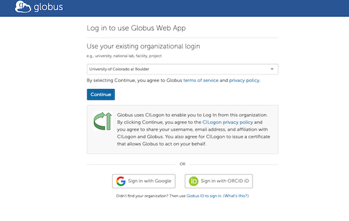
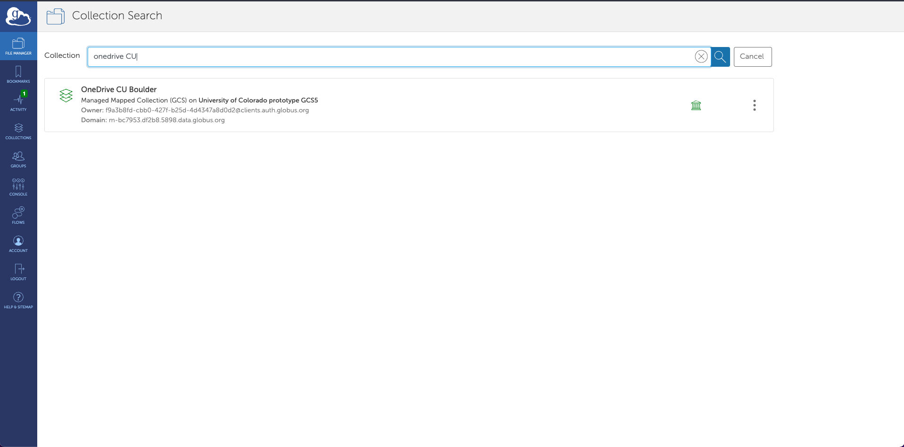
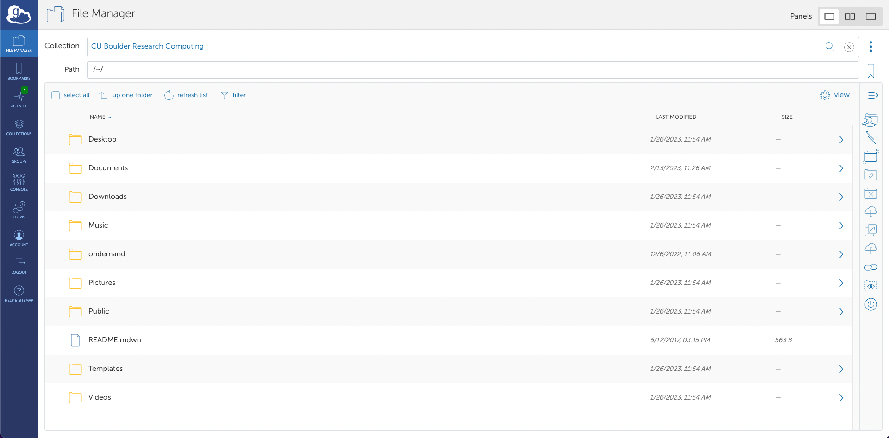
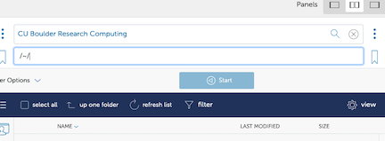

### Copy data from OneDrive to PetaLibrary

### Using Globus

#### Step 1: Log into the Globus Web App
Visit [https://app.globus.org](https://app.globus.org) and log in with your Colorado.edu credentials



#### Step 2: Open your OneDrive (right pane)
In the Collection search (right pane) enter: OneDrive CU Boulder - this should show your OneDrive contents



#### Step 3: Open CURC (left pane)
In the Collection search (left pane) enter: CU Boulder Research Computing

* You'll be asked to log in using your CURC Credentials - after clicking Authenticate you should receive a Duo push on your Duo device which you will need to confirm



* Once Authenticated you should see your CURC home directory - to access Petalibrary click "Up One Directory" and then select /pl



#### Step 4: Select files/folders from OneDrive to be transferred and initiate the transfer
* In the left pane, select the file or folder you'd like to transfer and click Start - this will initiate a Globus Transfer job


* View progress of your transfer under the Activity tab in the Globus App


### Using RClone

#### Step 1: download/install rclone and make sure you can run it

* Download the latest version from [https://rclone.org/downloads/](https://rclone.org/downloads/) and install per the developer's documentation.
* To test, run `rclone --version` at your prompt; if the software is installed a version number will be reported back to you, similar to:

```
$ rclone --version
rclone v1.54.1-DEV
- os/arch: freebsd/amd64
- go version: go1.16.2
```

#### Step 2: configure OneDrive remote configuration

_Note: the steps below are also outlined in the [Rclone Documentation for OneDrive](https://rclone.org/onedrive/). We only list the critical steps. If a step is left out, assume you can select the default setting._

* Type `rclone config` to create a new profile for transferring files between OneDrive and PetaLibrary
* When prompted for whether to configure a “new” or “existing” profile type `n` for "new remote"
* When prompted to name the new profile provide any descriptive name you like (e.g., `onedrive_johndoe_cu`)
* When prompted for the type of storage to configure, select the number of the option for "Microsoft OneDrive" (e.g., the number is "28" for _rclone_ v1.54.1)
* When prompted for Client ID leave the field blank
* When prompted for Client Secret leave the field blank
* When prompted choose national cloud region for OneDrive, select the number of the option for "Microsoft Cloud Global (global)" (e.g., the number is "1" for _rclone_ v1.54.1)
* When prompted for "Edit Advanced config?” choose "n" for no (default). 
* When prompted for "Use Auto config?” choose "n" for no (default). 
* You will then need to use your local machine terminal to run $rclone authorize "onedrive". This will open a window in your your browser, you may be asked to authenticate to your Microsoft account, and then you will be asked to allow Rclone to access the files in your `onedrive`. Complete this step to grant access.  If successful you'll receive a "success" message. 
* When prompted for Type of connection. Choose the appropriate answer, most likely "OneDrive Personal or Business (onedrive)" (e.g., the number is "1" for _rclone_ v1.54.1)
* When prompted for the drive you want to use. Choose the appropriate answer.
* When prompted asking if that drive is OK, choose the appropriate answer.
* Finally, you will be prompted to review the configuration and confirm whether it is okay. If everything looks okay, choose `yes` (default)
* Now type `q` to quit the configuration. 

##### Now test your OneDrive remote!

On your local machine type:
```bash
$ rclone ls onedrive_johndoe_cu
```
If this step fails, your OneDrive remote is not configured properly. Try reconfiguring your OneDrive remote again or contact [rc-help@colorado.edu](mailto:rc-help@colorado.edu) for assistance.

#### Step 3: Create your PetaLibrary remote configuration

See instructions for creating an [Rclone remote configuration for PetaLibrary](./rclone.html#configure-rclone)


* [Rclone documentation](https://rclone.org/)
* [CURC data transfer documentation](../../compute/data-transfer.html)

Couldn't find what you need? [Provide feedback on these docs!](https://forms.gle/bSQEeFrdvyeQWPtW9)
